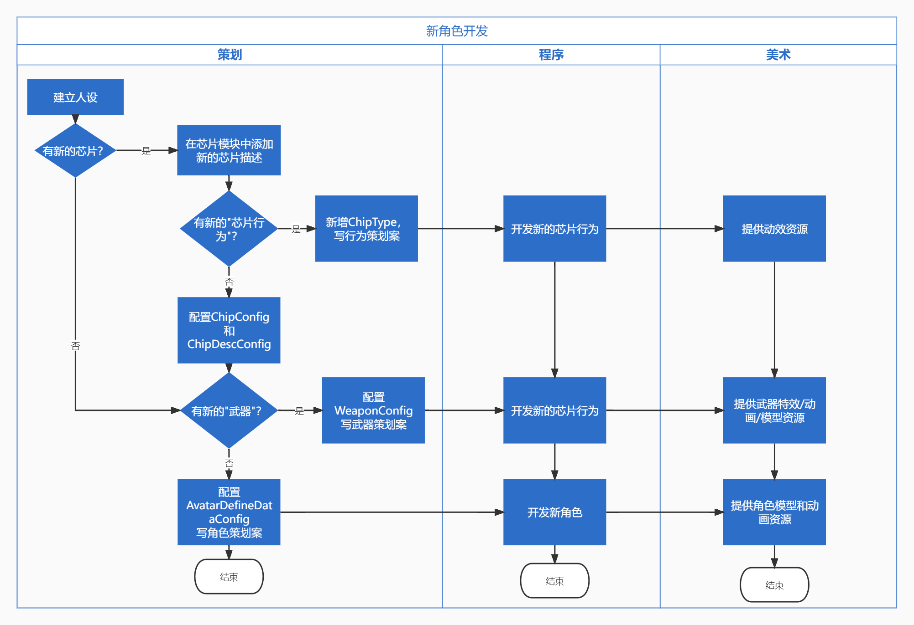

---

title : 角色组成

---

# 角色组成原理
## 角色组成结构
- 健康组件
- 能量组件
- 芯片槽组件
- 武器槽组件
- 模型组件
- 动画组件
## 角色组装流程

# 组件库
- 健康状态组件(HealthComponent)
  - 血量(uint32 hp)//描述物体的血量，等于0即阵亡

- 能量组件(EnergyComponent)
  - 能量储备(Uint32 energyReserve)//拥有的能量
  - 能量储备上限(Uint32 energyMax)//可以拥有能量的上限

- 芯片槽组件(ChipSlotComponent)
  - 芯片数组(Uint32[] chipIDArray)

- 武器槽组件(WeaponSlotComponent)
  - 武器数组(Weapon[] weaponArray)

- 模型组件(ModelComponent)
  - 模型路径 string modelPath

- 动画组件(AnimatorComponent)
  - 动画模组 Animator animator

# 数据结构
### 纯程序数据结构
- Weapon
  - Uint32 weaponID 
  - Uint32[] chipID
### 表数据结构
- ChipConfig //芯片表
  - Uint32 id   
  - ChipType type
  - Uint32[] paramArray//参数列表
- ChipDescConfig //芯片描述表
  - Unit32 id
  - string name
  - string desc 
- WeaponConfig
  - Uint32 id 
  - ModuleType Type
  - Uint32 ModuleID // 武器模组枪械的话就是gunconfig
  - String Model //武器模型路径
  - String pos // 武器挂点
  - Uint32 paramArray

- AvatarDefineDataConfig(角色默认数据配置表)
  - Uint32 hp
  - Uint32 energyMax
  - Uint32[] chipIDArray // 1~2是身体芯片3~6是武器芯片
  - Uint32[] weaponArray
  - string modelPath // 角色模型路径
  - string AnimatorModulePath //角色动画模组路径
  - 
- GunConfig
  - Uint32 id
  - ActionModel ActionModel // 行为模式
  - ShootingMode shootingMode // 射击模式
  - Uint32 MagazineCapacity //弹匣容量
### 枚举
- ChipType
    - WoldTime_Scale //改变 自身时间流逝速度
    - SelfTime_Scale //改变 世界时间流逝速度
    - Display_state //改变 自身的显示形态
    - EnergyShield //创造 能量护盾
    - 
- ModuleType 
  - Revolver // 左轮
  - SubmachineGun // 冲锋枪
- ActionModel
  - StraightLine_Precision_Shot // 直线精准射击
  - StraightLine_diffusion_Shot // 直线扩散射击
- ShootingMode
  - Full_Automatic // 全自动
  - Semi_Automatic // 半自动